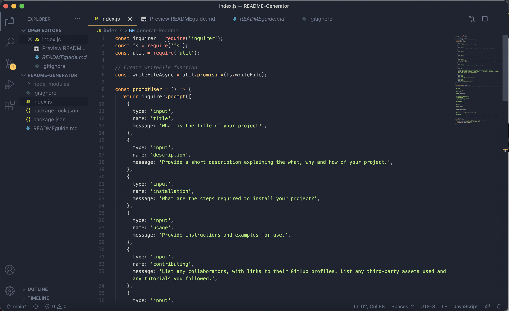
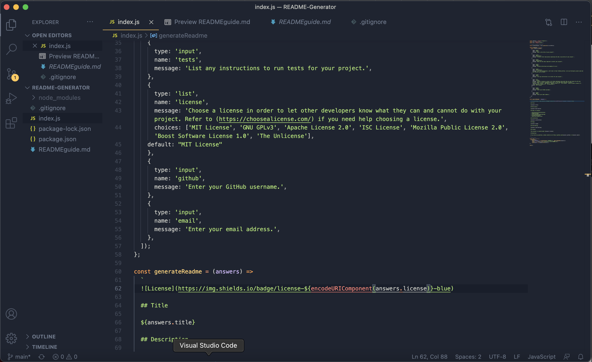
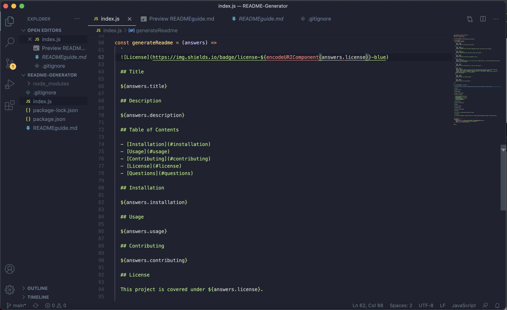
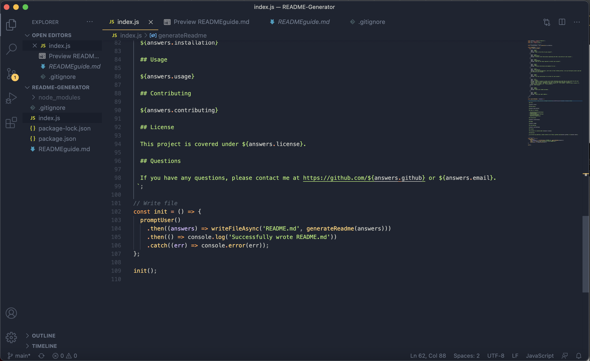

  
  
  ## Title

  README Generator

  ## Table of Contents

  - [Installation](#installation)
  - [Usage](#usage)
  - [Contributing](#contributing)
  - [License](#license)
  - [Questions](#questions)
  
  ## Description

  Walkthrough Video (https://drive.google.com/file/d/12Ihz5vBPoGksTPtwi883RTh3BQ1Ww_hE/view)

  This project uses the command line and Node.js to ask the user a series of questions in order to use their answers to write a markdown file formatted as a high quality README.

  
  
  
  

  ## Installation
  Install node.js. 
  Open the command-line terminal and type in node index.js.

  ## Usage

  Open command line interface and type node index.js. Proceed through the questions. Open the created README.me file that is created and edit if needed.

  ## License

  This project is covered under MIT License.

  ## Questions

  If you have any questions, please contact me at https://github.com/kilaweeks or kilaweeks@gmail.com.
 